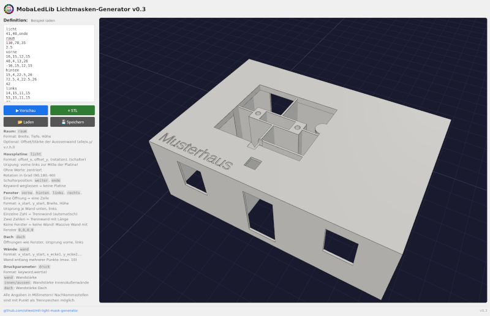

# MobaLedLib Lichtmasken-Generator

Dieser Generator erzeugt aus einer einfachen Text-Konfiguration eine druckfertige
3D-Lichtmaske (STL) für Modellgebäude. Die Maske wird von innen in das Gebäude
eingesetzt, trennt die Räume lichtdicht voneinander und nimmt die Hausplatine auf.



Diese Anleitung beschreibt **Schritt für Schritt, wie eine Konfiguration aufgebaut wird**.

---

## Bedienung in Kürze

1. Konfiguration in das Eingabefeld schreiben (oder eine vorhandene `.csv` laden).
2. **▶ Vorschau** klicken – das Modell erscheint rechts und lässt sich mit der Maus drehen.
3. Passt alles, mit **↓ STL** die Druckdatei speichern.

> **Tipp:** Fügt man Zellen aus einer Tabelle (z. B. Excel) ein, werden Tabulatoren
> automatisch in Kommas umgewandelt und die Vorschau startet von selbst.

---

## Vorbereitung

1. Stelle dein Modellhaus auf ein Blatt karriertes Papier und übertrage die
Aussenmaße auf das Papier.
2. Markiere alle Fenster und Türen durch einen dicken Strich auf der Wandlinie.
3. Messe für jedes Fenster den Abstand zur linken Hausecke und vom "Boden" sowie
   Breite und Höhe der Öffnung, schreibe die vier Zahlen an den Strich.
4. Bestimme den notwendigen Versatz der Maske nach Innen pro Wand, also um wieviel die gedruckte Maske kleiner sein muss als das Haus von außen.
5. Überlege dir die Position der Wände und skizziere Sie auf dem Papier
6. Finde eine geeignete Position für die Lichtplatine

---

## Grundregeln der Konfiguration

Eine Konfiguration besteht aus **Abschnitten**. Jeder Abschnitt beginnt mit einem
**Schlüsselwort** in einer eigenen Zeile, darunter folgen die zugehörigen **Datenzeilen**:

```
vorne
16,15,12.5,15
48,4,13,26
```

- Werte werden durch **Komma** getrennt.
- **Alle Maße in Millimetern.** Nachkommastellen mit Punkt schreiben (`2.5`, nicht `2,5`).
- Die Reihenfolge der Abschnitte ist frei wählbar.
- Mit `#` beginnt ein **Kommentar** – sowohl als ganze Zeile als auch am Zeilenende:

```
# Vorderseite
vorne
16,15,12.5,15 # Fenster Wohnzimmer
48,4,13,26  # Haustüre
```
### Koordinatensystem Grundkörper

Der Ursprung liegt in der **vorderen linken Ecke**. Von dort aus:

- **X** läuft nach **rechts** (= Breite),
- **Y** läuft nach **hinten** (= Tiefe)

### Koordinatensystem Fenster

Der Ursprung liegt in der **vorderen unteren Ecke** der Wand. Von dort aus:

- **X** läuft nach **rechts**,
- **Y** läuft nach **oben**

---

## Schritt 1 – Raumgröße und Offsets (`raum`)

Der `raum`-Abschnitt ist die Basis jeder Konfiguration.

**Erste Zeile – Außenmaße (Pflicht):** `Breite, Tiefe, Höhe`

```
raum
110,78,35
```

**Zweite Zeile – Offset (optional):** ein Versatz, um den die gedruckte Maske
gegenüber dem Raum nach innen verkleinert wird. Die Idee dahinter: Alle Maße
werden an der Außenseite des Hauses gemessen, der Generator rechnet automatisch
alle Positionen so um dass die Maske am Ende um den Versatz kleiner ist und
in das Haus geschoben werden kann.

> [!TIP] Die üblicherweise nach innen überstehender Fenster-/Türeinsätze oder
> Verstärkungen an den Kanten müssen beim Versatz mit berücksichtigt werden,
> sonst ist eure Maske nachher zu groß.

Je nach Anzahl der Werte:

| Werte | Bedeutung |
|-------|-----------|
| `2.5` | gleicher Offset auf **allen vier Seiten** |
| `2.5,1` | erste Zahl = **vorne & hinten**, zweite = **links & rechts** |
| `2,1,2,1` | je Seite einzeln: **vorne, rechts, hinten, links** |

```
raum
110,78,35
2.5
```

---

## Schritt 2 – Hausplatine platzieren (`licht`)

Der `licht`-Abschnitt bestimmt, wo die Platine sitzt. Die Platinenaufnahme hat ein
festes Format von **41 × 36 mm** und muss mit etwas Abstand vollständig innerhalb
der Maske liegen.

**Format:** `Mitte-X, Mitte-Y [, Rotation] [, Schalter]`

- `Mitte-X, Mitte-Y` = Koordinaten des **Platinenmittelpunkts** (vom Ursprung vorne links).
- `Rotation` (optional) = Drehung in Grad: `90`, `180`, `-90`.
- `Schalter` (optional) = Position des Schalterausschnitts: `weiter` oder `ende`.

```
licht
41,40,ende
```

Weitere Möglichkeiten:

- **Automatisch zentrieren:** Abschnitt `licht` ohne Werte (oder eine einzelne `0`)
  schreiben – die Platine wird mittig im Raum platziert.
- **Keine Platine:** den `licht`-Abschnitt komplett weglassen.

> [!INFO] Unter der Platine wird immer der Tunnel für den Anschluß und vier
> Wandstücke bis an den Dachausschnitt eingefügt.

---

## Schritt 3 – Fenster und Türen (`vorne`, `hinten`, `links`, `rechts`)

Für jede Außenwand gibt es einen eigenen Abschnitt. Jede **Öffnung** (Fenster oder
Tür) ist eine **eigene Zeile**.

**Format:** `Abstand, Höhe-über-Boden, Breite, Höhe`

- `Abstand` = horizontale Lage entlang der Wand, gemessen von der Ecke.
- `Höhe-über-Boden` = Abstand der **Unterkante** vom Boden.
- `Breite, Höhe` = Größe der Öffnung.

Der Ursprung jeder Wand liegt **unten links** (von außen betrachtet). Ein **negativer
Abstand** misst von der **gegenüberliegenden Ecke** – praktisch für Öffnungen, die
rechts bündig sitzen sollen.

```
vorne
16,15,12,15
48,4,13,26
-16,15,12,15
```

> [!CAUTION] Eine Wand ohne Einträge wird **gar nicht gedruckt**. Soll eine Wand
> massiv (geschlossen, ohne Fenster) sein, trägt man eine „Null-Öffnung“ ein: `0,0,0,0`.

---

## Schritt 4 – Automatikwände (Trennwände)

In denselben Wandabschnitten (`vorne`, `hinten`, `links`, `rechts`) lassen sich
**innere Trennwände** definieren, indem statt vier Werten nur **eine oder zwei Zahlen**
in der Zeile stehen:

- **Eine Zahl** → automatische Trennwand: Die Zahl ist die **Position** entlang der
  Wand. Die Trennwand wächst von der Außenwand nach innen bis zum Dachausschnitt
  der Platine. Die Lücke zwischen der Wand und der Stützwand der Platine wird
  entlang der Dachkante automatisch geschlossen.
- **Zwei Zahlen** (`Position, Länge`) → Trennwand mit **fester Länge**, es
  findet keine automatische Verbindung mit der Stützstruktur statt.

```
hinten
15,4,22.5,26     ← Fenster (4 Werte)
72.5,4,22.5,26   ← Fenster (4 Werte)
42               ← automatische Trennwand bei Position 42
```

Ein negativer Positionswert misst wieder von der gegenüberliegenden Ecke.

---

## Schritt 5 –  Freie Wände (`wand`)

Für Innenwände, die nicht an einer Außenwand beginnen, gibt es den `wand`-Abschnitt.
Eine Zeile beschreibt einen **Linienzug** aus Eckpunkten – die Wand verläuft von Punkt
zu Punkt.

**Format:** `x1, y1, x2, y2 [, x3, y3, …]` (2 bis 10 Punkte)

```
wand
41,0,41,25,66,25,66,0
```

Auch hier messen negative Koordinaten von der rechten bzw. hinteren Raumkante.
Die Wände können anhand der Außenmaße gesetzt werden, der Generator beschneidet
die Länge automatisch an der Außenhülle der Maske.

---

##  Optional – Beschriftung (`text`)

Beschriftet die Oberseite der Maske, z. B. mit dem Hausnamen (max. 50 Zeichen).

**Format (je nach Detailgrad):**

| Zeile | Bedeutung |
|-------|-----------|
| `Musterhaus` | Text, automatisch platziert |
| `20,30,Musterhaus` | Text an Position `X,Y` |
| `20,30,90,Musterhaus` | Text an Position `X,Y` mit Drehung in Grad |

```
text
Musterhaus
```

## Optional – Dachöffnungen (`dach`)

Zusätzliche Öffnungen in der Dachfläche, z. B. für Dachfenster oder zum Einbau weiterer LEDs von oben.

**Format:**
- `X, Y, Breite, Tiefe` – rechteckiger Ausschnitt (Ecke bei X,Y, Ursprung vorne links)
- `X, Y, <LED-Typ>` – Öffnung passend zu einem LED-Typ (Mitte bei X,Y); die Geometrie
  wird wie in der Lichtbox erzeugt. Anstelle der Ausschnitt-Masse wird der Name des
  LED-Typs angegeben: `none`, `3mm`, `5mm`, `plcc6`, `plcc2`, `ws2812`.

```
dach
44,10,5,5
55,40,ws2812
```

---

## Optional – Druckparameter (`druck`)

Feineinstellung der Wandstärken. Jede Zeile: `Schlüssel, Wert`.

| Schlüssel | Bedeutung | Standard |
|-----------|-----------|----------|
| `wand` | allgemeine Wandstärke | 0.8 mm |
| `aussen` | Stärke der Außenwände | wie `wand` |
| `innen` | Stärke der Innenwände | wie `wand` |
| `dach` | Stärke der Dachfläche | 1.0 mm |

```
druck
aussen,1.0
dach,1.2
```

---

## Vollständiges Beispiel

```
licht
41,40,ende
raum
110,78,35
2.5
vorne
16,15,12,15
48,4,13,26
-16,15,12,15
hinten
15,4,22.5,26
72.5,4,22.5,26
42
links
14,15,11,15
53,15,11,15
42
rechts
14,15,11,15
53,15,11,15
42
wand
41,0,41,25,66,25,66,0
dach
44,10,5,5
text
Musterhaus
```
