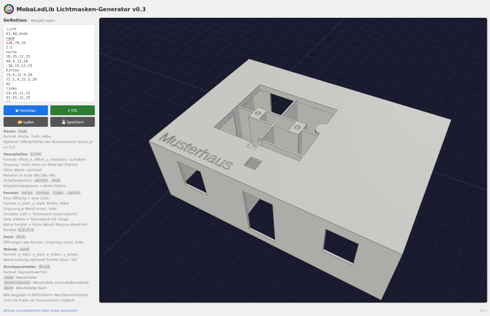

# MobaLedLib Lichtmasken-Generator

Dieser Generator erzeugt aus einer einfachen Text-Konfiguration eine druckfertige
3D-Lichtmaske (STL) für Modellgebäude. Die Maske wird von innen in das Gebäude
eingesetzt, trennt die Räume lichtdicht voneinander und nimmt die Hausplatine auf.



Diese Anleitung beschreibt **Schritt für Schritt, wie eine Konfiguration aufgebaut wird**.

---

## Bedienung in Kürze

1. Konfiguration in das Eingabefeld schreiben (oder eine vorhandene `.csv` laden).
2. **▶ Vorschau** klicken – das Modell erscheint rechts und lässt sich mit der Maus drehen.
3. Passt alles, mit **↓ STL** die Druckdatei speichern.

> **Tipp:** Fügt man Zellen aus einer Tabelle (z. B. Excel) ein, werden Tabulatoren
> automatisch in Kommas umgewandelt und die Vorschau startet von selbst.

---

## Vorbereitung

1. Stelle dein Modellhaus auf ein Blatt karriertes Papier und übertrage die
Aussenmaße auf das Papier.
2. Markiere alle Fenster und Türen durch einen dicken Strich auf der Wandlinie.
3. Messe für jedes Fenster den Abstand zur linken Hausecke und vom "Boden" sowie
   Breite und Höhe der Öffnung, schreibe die vier Zahlen an den Strich.
4. Bestimme den notwendigen Versatz der Maske nach Innen pro Wand, also um wieviel die gedruckte Maske kleiner sein muss als das Haus von außen.
5. Überlege dir die Position der Wände und skizziere Sie auf dem Papier
6. Finde eine geeignete Position für die Lichtplatine

---

## Grundregeln der Konfiguration

Eine Konfiguration besteht aus **Abschnitten**. Jeder Abschnitt beginnt mit einem
**Schlüsselwort** in einer eigenen Zeile, darunter folgen die zugehörigen **Datenzeilen**:

```
vorne
16,15,12.5,15
48,4,13,26
```

- Werte werden durch **Komma** getrennt.
- **Alle Maße in Millimetern.** Nachkommastellen mit Punkt schreiben (`2.5`, nicht `2,5`).
  Jeder einzelne Wert muss zwischen `-9999` und `9999` liegen.
- Die Reihenfolge der Abschnitte ist frei wählbar. Einzige Ausnahme: der
  Fenster-Abschnitt einer [benannten Wand](#fenster-in-einer-freien-wand) muss
  **nach** der `wand`-Zeile stehen, die den Namen vergibt.
- Mit `#` beginnt ein **Kommentar** – sowohl als ganze Zeile als auch am Zeilenende:

```
# Vorderseite
vorne
16,15,12.5,15 # Fenster Wohnzimmer
48,4,13,26  # Haustüre
```
### Koordinatensystem Grundkörper

Der Ursprung liegt in der **vorderen linken Ecke**. Von dort aus:

- **X** läuft nach **rechts** (= Breite),
- **Y** läuft nach **hinten** (= Tiefe)

### Koordinatensystem Fenster

Der Ursprung liegt in der **vorderen unteren Ecke** der Wand. Von dort aus:

- **X** läuft nach **rechts**,
- **Y** läuft nach **oben**

---

## Schritt 1 – Raumgröße und Offsets (`raum`)

Der `raum`-Abschnitt ist die Basis jeder Konfiguration.

**Erste Zeile – Außenmaße (Pflicht):** `Breite, Tiefe, Höhe`

```
raum
110,78,35
```

**Zweite Zeile – Offset (optional):** ein Versatz, um den die gedruckte Maske
gegenüber dem Raum nach innen verkleinert wird. Die Idee dahinter: Alle Maße
werden an der Außenseite des Hauses gemessen, der Generator rechnet automatisch
alle Positionen so um dass die Maske am Ende um den Versatz kleiner ist und
in das Haus geschoben werden kann.

> [!TIP] Die üblicherweise nach innen überstehender Fenster-/Türeinsätze oder
> Verstärkungen an den Kanten müssen beim Versatz mit berücksichtigt werden,
> sonst ist eure Maske nachher zu groß.

Je nach Anzahl der Werte:

| Werte | Bedeutung |
|-------|-----------|
| `2.5` | gleicher Offset auf **allen vier Seiten** |
| `2.5,1` | wie die Maßzeile: erste Zahl = **Breite** (links & rechts), zweite = **Tiefe** (vorne & hinten) |
| `2,1,2,1` | je Seite einzeln: **vorne, rechts, hinten, links** |

> [!CAUTION] Die Reihenfolge unterscheidet sich zwischen den beiden Formen. Mit
> **zwei** Werten zählt die Zeile **Achsen** wie die Maßzeile: `Breite, Tiefe`.
> Mit **vier** Werten zählt sie **Seiten** reihum ab vorne:
> `vorne, rechts, hinten, links`. Die vier Seiten einzeln zu setzen heißt also
> nicht, einfach zwei Werte anzuhängen – `2,1` entspricht `1,2,1,2`.

```
raum
110,78,35
2.5
```

### Dritte Zeile – Stockwerk (`G<n>`), optional

Werden mehrere Räume übereinander gestapelt, bekommt der `raum`-Abschnitt eine
eigene Zeile `G<n>` mit der Stockwerksnummer (`G0` = Erdgeschoss, einstellig).
Sie gilt für den ganzen Raum und setzt automatisch:

- jedes **ungerade** Stockwerk dreht alle Platinen um 180°, damit die Anschlüsse
  abwechselnd liegen,
- die Ziffer wird in die **vordere rechte Ecke** des Dachs graviert, sodass am
  gedruckten Teil ablesbar ist, zu welchem Stockwerk es gehört,
- an den vier **Innenecken der Außenwände** kommt je eine Aussparung im Dach;
  ab `G1` sitzt an denselben Ecken unten ein passender Zapfen. Aufeinandergesetzt
  rasten die Räume darüber ineinander ein. An einer Ecke, an der beide
  angrenzenden Außenwände fehlen (Wand ohne Öffnungen), entfällt der Zapfen.

Die Ecken liegen **innen an den Wänden**, die Außenkontur der Maske bleibt also
unberührt und beim Einschieben ins Haus setzt nichts auf. Drei Ecken sind
Quadrate mit 2 mm Kantenlänge, die Ecke **vorne links** ist ein Viertelkreis mit
3 mm Radius – damit passen gestapelte Räume nur in einer Drehlage zusammen.

Die Offset-Zeile darf fehlen, `G<n>` steht dann direkt unter den Außenmaßen.

```
raum
110,78,35
2.5
G1
```

---

## Schritt 2 – Hausplatine platzieren (`licht`)

Der `licht`-Abschnitt bestimmt, wo die Platine sitzt. Die Platinenaufnahme hat ein
festes Format von **41 × 36 mm** und muss mit mindestens **2 mm** Abstand
vollständig innerhalb der Maske liegen.

**Format:** `Mitte-X, Mitte-Y [, Rotation] [, Schalter] [, Anschluss]`

- `Mitte-X, Mitte-Y` = Koordinaten des **Platinenmittelpunkts** (vom Ursprung vorne links).
- `Rotation` (optional) = Drehung in Grad: `90`, `180`, `-90`. Ohne Angabe setzt die Stockwerkszeile `G<n>` des `raum`-Abschnitts die Drehung.
- `Schalter` (optional) = Position des Schalterausschnitts: `weiter` oder `ende`.
- `Anschluss` (optional) = Schlüsselwort: `idc` druckt die IDC-Buchse mit, `stack` nur die Führung für die Platinenverbinder. Ohne Schlüsselwort bleibt der Tunnel offen.

Werden beide Schlüsselwörter angegeben, steht `Schalter` **vor** `Anschluss`:
`41,40,ende,idc` ist gültig, `41,40,idc,ende` nicht.

```
licht
41,40,ende,idc
```

Weitere Möglichkeiten:

- **Automatisch zentrieren:** Abschnitt `licht` ohne Werte (oder eine einzelne `0`)
  schreiben – die Platine wird mittig im Raum platziert.
- **Keine Platine:** den `licht`-Abschnitt komplett weglassen.

> [!INFO] Unter der Platine wird immer der Tunnel für den Anschluß und vier
> Wandstücke bis an den Dachausschnitt eingefügt.

---

## Schritt 3 – Fenster und Türen (`vorne`, `hinten`, `links`, `rechts`)

Für jede Außenwand gibt es einen eigenen Abschnitt. Jede **Öffnung** (Fenster oder
Tür) ist eine **eigene Zeile**.

**Format:** `Abstand, Höhe-über-Boden, Breite, Höhe`

- `Abstand` = horizontale Lage entlang der Wand, gemessen von der Ecke.
- `Höhe-über-Boden` = Abstand der **Unterkante** vom Boden.
- `Breite, Höhe` = Größe der Öffnung.

Der Ursprung jeder Wand liegt **unten links** (von außen betrachtet). Ein **negativer
Abstand** misst von der **gegenüberliegenden Ecke** – praktisch für Öffnungen, die
rechts bündig sitzen sollen.

```
vorne
16,15,12,15
48,4,13,26
-16,15,12,15
```

> [!CAUTION] Eine Wand ohne Einträge wird **gar nicht gedruckt**. Soll eine Wand
> massiv (geschlossen, ohne Fenster) sein, trägt man eine „Null-Öffnung“ ein: `0,0,0,0`.

---

## Schritt 4 – Automatikwände (Trennwände)

In denselben Wandabschnitten (`vorne`, `hinten`, `links`, `rechts`) lassen sich
**innere Trennwände** definieren, indem statt vier Werten nur **eine oder zwei Zahlen**
in der Zeile stehen:

- **Eine Zahl** → automatische Trennwand: Die Zahl ist die **Position** entlang der
  Wand. Die Trennwand wächst von der Außenwand nach innen bis zum Dachausschnitt
  der Platine. Die Lücke zwischen der Wand und der Stützwand der Platine wird
  entlang der Dachkante automatisch geschlossen. Sind mehrere Platinen definiert,
  läuft die Wand zu der Platine, deren Mitte ihrem Ansatzpunkt an der Außenwand
  am nächsten liegt.
- **Zwei Zahlen** (`Position, Länge`) → Trennwand mit **fester Länge**, es
  findet keine automatische Verbindung mit der Stützstruktur statt.

```
hinten
15,4,22.5,26     # Fenster (4 Werte)
72.5,4,22.5,26   # Fenster (4 Werte)
42               # automatische Trennwand bei Position 42
```

Ein negativer Positionswert misst wieder von der gegenüberliegenden Ecke.

---

## Schritt 5 –  Freie Wände (`wand`)

Für Innenwände, die nicht an einer Außenwand beginnen, gibt es den `wand`-Abschnitt.
Eine Zeile beschreibt einen **Linienzug** aus Eckpunkten – die Wand verläuft von Punkt
zu Punkt.

**Format:** `x1, y1, x2, y2 [, x3, y3, …]` (mindestens 2 Punkte, nach oben offen)

Ein `wand`-Abschnitt nimmt beliebig viele solcher Zeilen auf; jede ist eine
**eigenständige** Wand.

```
wand
41,0,41,25,66,25,66,0    # ein Linienzug über drei Segmente
27,0,27,22               # davon unabhängige zweite Wand
```

**Linienzug über mehrere Zeilen:** Trägt eine Zeile nur **ein** Koordinatenpaar,
verlängert sie die zuletzt begonnene Wand um diesen Punkt – unabhängig davon, wie
viele Punkte deren vorige Zeile hatte. Eine Zeile mit **zwei oder mehr** Paaren
beginnt dagegen immer eine neue Wand.

```
wand
10,10               # ┐
20,20               # ├ eine Wand über zwei Segmente
30,30               # ┘
40,40,50,50         # neue Wand …
60,20               # … um einen Punkt verlängert
```

> [!CAUTION] Ein einzelnes Koordinatenpaar, das nichts fortsetzt und selbst nicht
> fortgesetzt wird, ergibt kein Segment und wird als Fehler gemeldet.

Auch hier messen negative Koordinaten von der rechten bzw. hinteren Raumkante.
Die Wände können anhand der Außenmaße gesetzt werden, der Generator beschneidet
die Länge automatisch an der Außenhülle der Maske.

### Fenster in einer freien Wand

Ein einzelnes **gerades** Segment eines Linienzugs lässt sich benennen und bekommt
dann eigene Fenster – wie eine Außenwand. Der Name ist ein beliebiges Wort, das
hinter dem **Startpunkt** des Segments steht; das Segment endet am nächsten Punkt.

**Format:** `x1, y1, name, x2, y2` – oder zweizeilig, mit dem Endpunkt in der Folgezeile:

```
wand
20,10,flur
20,50
```

Der Name wird anschließend zum **Abschnitts-Schlüsselwort** für die Öffnungen. Sie
werden wie bei den Außenwänden angegeben, der `Abstand` misst dabei ab dem
Startpunkt der Wand (`x1, y1`):

```
flur
5,0,8,12
25,4,6,8
```

- Der Name darf kein reserviertes Schlüsselwort sein (`raum`, `wand`, `vorne`, …)
  und nicht zweimal vergeben werden.
- Der Fenster-Abschnitt muss **nach** der `wand`-Zeile stehen, die den Namen
  vergibt – sonst ist der Name noch unbekannt und die Datei wird abgewiesen.
- Benannt wird immer nur **ein** Segment, nicht der ganze Linienzug. Ein Linienzug
  kann mehrere benannte Segmente enthalten.
- Ohne zugehörigen Fenster-Abschnitt bleibt das Segment eine normale freie Wand.
- Anders als bei den Außenwänden ist der `Abstand` hier immer positiv; negative
  Werte werden nicht von der Gegenecke gemessen, sondern abgewiesen.

---

##  Optional – Beschriftung (`text`)

Beschriftet die Oberseite der Maske, z. B. mit dem Hausnamen (max. 50 Zeichen).

**Format (je nach Detailgrad):**

| Zeile | Bedeutung |
|-------|-----------|
| `Musterhaus` | Text, automatisch platziert: 3 mm/3 mm von der vorderen linken Ecke des **Druckkörpers**, wandert also mit dem Offset |
| `20,30,Musterhaus` | Text an Position `X,Y` |
| `20,30,90,Musterhaus` | Text an Position `X,Y` mit Drehung in Grad |

```
text
Musterhaus
```

Zwei Einschränkungen ergeben sich aus dem CSV-Format: Der Text darf **kein Komma**
enthalten (es trennt die Felder), und er darf nicht genauso heißen wie ein
Abschnitts-Schlüsselwort oder eine benannte Wand – ein solches Wort beendet den
`text`-Abschnitt, statt als Beschriftung zu gelten.

---

## Optional – Dachöffnungen (`dach`)

Zusätzliche Öffnungen in der Dachfläche, z. B. für Dachfenster oder zum Einbau weiterer LEDs von oben.

**Format:**
- `X, Y, Breite, Tiefe` – rechteckiger Ausschnitt (Ecke bei X,Y, Ursprung vorne links)
- `X, Y, <LED-Typ>` – Öffnung passend zu einem LED-Typ (Mitte bei X,Y); die Geometrie
  wird wie in der Lichtbox erzeugt. Anstelle der Ausschnitt-Masse wird der Name des
  LED-Typs angegeben: `none` (auch `keine`), `3mm`, `5mm`, `plcc6`, `plcc2`, `ws2812`.

```
dach
44,10,5,5
55,40,ws2812
```

---

## Optional – Druckparameter (`druck`)

Feineinstellung der Wandstärken. Jede Zeile: `Schlüssel, Wert`.

| Schlüssel | Bedeutung | Standard |
|-----------|-----------|----------|
| `wand` | allgemeine Wandstärke | 0.8 mm |
| `aussen` | Stärke der Außenwände | wie `wand` |
| `innen` | Stärke der Innenwände | wie `wand` |
| `dach` | Stärke der Dachfläche | 1.0 mm |

```
druck
aussen,1.0
dach,1.2
```

---

## Lichtbox-Modus (`box`)

Statt einer kompletten Hausmaske (`raum`) lässt sich auch eine einzelne **Lichtbox**
erzeugen – ein kleiner Kasten, der über eine LED gestülpt wird und das Licht
gerichtet abgibt. Sobald das Schlüsselwort `box` in der Konfiguration vorkommt,
schaltet der Generator auf den Lichtbox-Renderer (`lightbox.scad`) um; `box` und
`raum` schließen sich gegenseitig aus.

**Erste Zeile – Außenmaße (Pflicht):** `Breite, Höhe, Tiefe`

```
box
40,25,15
```

### LED-Öffnungen (`oben`, `links`, `rechts`)

Die Schlüsselwörter `oben`, `links` und `rechts` setzen je eine (oder mehrere)
LED-Öffnung auf die entsprechende Fläche. Jede Öffnung ist eine eigene Zeile, die
mit dem **LED-Typ** beginnt:

| LED-Typ | Bedeutung |
|---------|-----------|
| `none` (auch `keine`) | keine Öffnung |
| `3mm` | durchgehende Bohrung 3 mm |
| `5mm` | durchgehende Bohrung 5 mm |
| `plcc6` | PLCC6 (innen 4 mm, außen 6×6 mm) |
| `plcc2` | PLCC2 (innen 3 mm, außen 4×3 mm) |
| `ws2812` | innen 6×6 mm, außen 15 mm |

**Format:** `<typ> [, <clip>] [, offset_breite [, offset_tiefe]]`

- Nur `<typ>` → LED **mittig** auf der Fläche.
- `<clip>` (optional, 2. Argument) → Halteclip: `ohne`, `einfach` oder `doppel`.
  Standard ist `ohne` und kann weggelassen werden.
- `offset_breite` → Verschiebung **entlang der Vorderkante** der Fläche.
- `offset_tiefe` → zusätzliche Verschiebung **in Tiefenrichtung (Z)**.

Die Offsets messen von der **Flächenmitte** aus und dürfen der Kante nicht näher
als **5 mm** kommen.

```
box
40,25,15
oben
plcc6, doppel
links
ws2812, 4
rechts
plcc2, einfach, 4, -2
```

---

## Vollständiges Beispiel

```
licht
41,40,ende,idc
raum
110,78,35
2.5
vorne
16,15,12,15
48,4,13,26
-16,15,12,15
hinten
15,4,22.5,26
72.5,4,22.5,26
42
links
14,15,11,15
53,15,11,15
42
rechts
14,15,11,15
53,15,11,15
42
wand
41,0,41,25,66,25,66,0
dach
44,10,5,5
text
Musterhaus
```

---

## Anhang – Generator starten

Der Generator ist ein kleiner Webserver, der OpenSCAD zum Rendern aufruft. Beides
muss lokal installiert sein.

```
python3 server.py
```

Danach ist die Oberfläche unter **http://localhost:8080** erreichbar. Sie lädt die
Vorschau über `POST /preview` und liefert die Downloads über `POST /` (STL) und
`POST /export3mf` (3MF).

Ohne Oberfläche lässt sich eine Konfiguration auch direkt übersetzen – die Ausgabe
ist das Datenfile, das `house_mask.scad` einliest:

```
python3 server.py --parse meine_maske.csv > house_data.scad
```

Mit `--debug` schreibt der Server zusätzlich das Datenfile jeder Anfrage auf die
Konsole – hilfreich, um nachzusehen, was aus einer Konfiguration tatsächlich
geworden ist.
